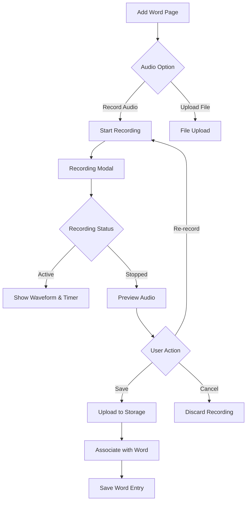

# Audio Recording Feature - Product Requirements Document

## 1. Product Overview

This feature enables users to record audio pronunciation directly within the application instead of uploading pre-recorded audio files. This provides a more seamless and user-friendly experience for language learners who want to add pronunciation to their word entries.

**Target Users:** Language learners, educators, and content creators who want to add authentic pronunciation examples to words.

**Value Proposition:** Eliminates the need for external recording tools and file management, making content creation faster and more accessible.

## 2. Core Features

### 2.1 User Roles
| Role | Registration Method | Core Permissions |
|------|---------------------|------------------|
| All Users | Email/Social Auth | Record, preview, and save audio pronunciations |
| Premium Users | Subscription upgrade | Extended recording duration, higher quality audio |

### 2.2 Feature Module

Our audio recording feature consists of the following main components:
1. **Recording Interface:** Audio recording controls, visual feedback, and duration display
2. **Preview & Playback:** Listen to recorded audio before saving
3. **Audio Management:** Save, re-record, or cancel audio recordings
4. **Storage Integration:** Automatic upload and association with word entries

### 2.3 Page Details

| Page/Component | Module Name | Feature description |
|-----------|-------------|---------------------|
| AddWord Page | Audio Recording Section | Display record button, show recording status, provide playback controls |
| Recording Modal | Recording Interface | Start/stop recording, visual waveform feedback, duration timer |
| Preview Component | Audio Playback | Play/pause recorded audio, volume control, re-record option |
| Word Detail Page | Pronunciation Player | Play saved pronunciation, show recording metadata |

## 3. Core Process

### User Flow - Recording Pronunciation


## 4. User Interface Design

### 4.1 Design Style
- **Primary Colors:** Blue for recording active state, gray for inactive
- **Button Style:** Rounded buttons with clear icons (microphone, play, pause)
- **Visual Feedback:** Animated waveform during recording, progress indicators
- **Layout Style:** Modal overlay for recording, inline controls for playback
- **Icons:** Material Design icons for consistency

### 4.2 Page Design Overview

| Component | UI Elements |
|-----------|-------------|
| Recording Button | Circular button with microphone icon, changes color when active |
| Waveform Display | Real-time audio visualization during recording |
| Duration Timer | Shows recording length in MM:SS format |
| Preview Controls | Play/pause button, progress bar, volume slider |
| Action Buttons | Save, Re-record, Cancel with clear visual hierarchy |

### 4.3 Responsiveness
- **Mobile-First:** Optimized for touch interactions on mobile devices
- **Desktop Adaptive:** Larger controls and expanded interface on desktop
- **Touch Optimization:** Minimum 44px touch targets for mobile

## 5. Technical Requirements

### 5.1 Audio Recording Specifications
- **Format:** MP3 or WebM with Opus codec for optimal compression
- **Sample Rate:** 44.1kHz for good quality
- **Bit Rate:** 128kbps for balanced quality and file size
- **Maximum Duration:** 30 seconds for free users, 2 minutes for premium
- **File Size Limit:** 2MB per recording

### 5.2 Browser Compatibility
- **Recording API:** MediaRecorder API with fallback to getUserMedia
- **Supported Browsers:** Chrome 49+, Firefox 29+, Safari 14+, Edge 79+
- **Mobile Support:** iOS Safari 14.3+, Chrome for Android
- **Permissions:** Microphone access with user consent

### 5.3 Storage Strategy
- **Storage Provider:** Supabase Storage for audio files
- **File Naming:** `{user_id}/{word_id}_{timestamp}.mp3`
- **CDN Integration:** Automatic CDN delivery for audio playback
- **Backup Strategy:** Regular backups of audio files

### 5.4 Error Handling
- **Permission Denied:** Clear message when microphone access is blocked
- **Recording Failed:** Retry option and fallback to file upload
- **Network Issues:** Offline queue for uploads, retry mechanism
- **Storage Limit:** User notification when approaching storage limits

## 6. Integration Points

### 6.1 AddWord Component Integration
- Replace or supplement existing file upload input
- Add recording button next to audio upload area
- Maintain backward compatibility with file uploads
- Update form validation to handle recorded audio

### 6.2 Database Schema Updates
```sql
-- Add audio recording metadata to words table
ALTER TABLE words ADD COLUMN audio_url TEXT;
ALTER TABLE words ADD COLUMN audio_duration INTEGER;
ALTER TABLE words ADD COLUMN audio_recorded_at TIMESTAMP;
ALTER TABLE words ADD COLUMN is_recorded BOOLEAN DEFAULT FALSE;
```

### 6.3 Supabase Storage Policies
- Authenticated users can upload to their own directory
- Public read access for audio playback
- Automatic cleanup when words are deleted

## 7. Implementation Phases

### Phase 1: Core Recording (MVP)
- Basic recording functionality
- Simple playback preview
- Upload to Supabase Storage
- Associate with word entries

### Phase 2: Enhanced Features
- Waveform visualization
- Audio editing (trim, fade)
- Recording quality settings
- Offline recording capability

### Phase 3: Advanced Features
- Multiple pronunciation support
- Community audio contributions
- Audio transcription integration
- Advanced audio analytics

## 8. Success Metrics

### 8.1 User Engagement
- Percentage of words with audio recordings
- Average recording duration per user
- User retention with audio-enabled words

### 8.2 Technical Performance
- Recording success rate (>95%)
- Average upload time (<5 seconds)
- Audio playback load time (<2 seconds)

### 8.3 Quality Metrics
- User satisfaction with recording quality
- Support tickets related to audio issues
- Storage usage efficiency

## 9. Testing Strategy

### 9.1 Functional Testing
- Recording and playback across browsers
- File upload and storage integration
- Error handling scenarios
- Permission management

### 9.2 Performance Testing
- Recording under various network conditions
- Concurrent user recording scenarios
- Storage upload performance
- Audio file compression efficiency

### 9.3 User Acceptance Testing
- Ease of use for first-time users
- Accessibility compliance
- Mobile device compatibility
- Integration with existing workflows

## 10. Future Considerations

### 10.1 Advanced Features
- Real-time audio transcription
- Pronunciation accuracy scoring
- Multi-language voice recognition
- AI-powered pronunciation feedback

### 10.2 Platform Expansion
- Native mobile app integration
- Desktop application support
- Third-party integrations
- API for external developers

### 10.3 Monetization
- Premium recording features
- Extended storage options
- Advanced audio analytics
- Commercial licensing for audio content