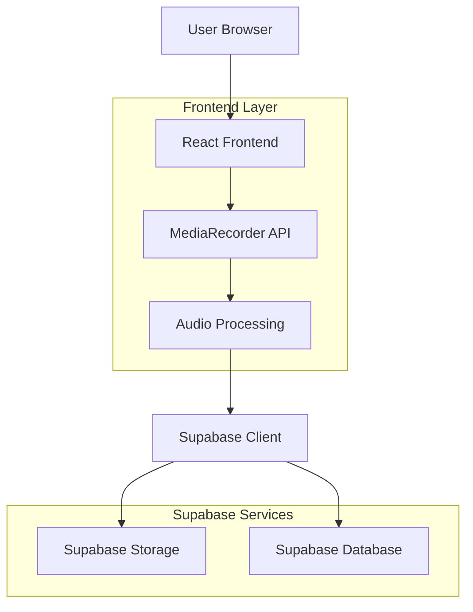
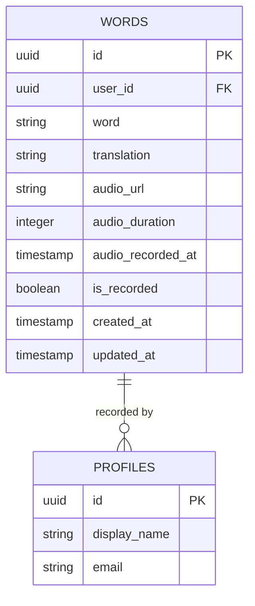

# Audio Recording Feature - Technical Architecture Document

## 1. Architecture Design



## 2. Technology Stack

### Frontend Technologies
- **React 18** - Component framework
- **TypeScript** - Type safety
- **Web Audio API** - Audio processing
- **MediaRecorder API** - Recording functionality
- **Tailwind CSS** - UI styling

### Backend & Storage
- **Supabase Storage** - Audio file storage
- **Supabase Database** - Metadata storage
- **PostgREST** - API layer
- **Row Level Security** - Access control

### Audio Processing Libraries
- **wavesurfer.js** - Waveform visualization
- **lamejs** - MP3 encoding (fallback)
- **opus-recorder** - Opus codec support

## 3. Component Architecture

### 3.1 Audio Recording Component Structure
```
src/
├── components/
│   ├── AudioRecorder/
│   │   ├── AudioRecorder.tsx          # Main recording component
│   │   ├── WaveformVisualizer.tsx     # Real-time waveform display
│   │   ├── RecordingControls.tsx      # Play/pause/stop buttons
│   │   ├── AudioPreview.tsx           # Playback preview
│   │   └── AudioUploader.tsx          # Upload integration
│   └── ui/
│       └── AudioProgressBar.tsx       # Recording progress
├── hooks/
│   ├── useAudioRecorder.ts            # Recording logic hook
│   ├── useAudioPlayback.ts            # Playback control hook
│   └── useAudioStorage.ts             # Storage management hook
├── utils/
│   ├── audioProcessing.ts             # Audio format conversion
│   ├── audioValidation.ts             # File validation
│   └── audioStorage.ts                # Storage utilities
```

### 3.2 Key Components

**AudioRecorder.tsx**
```typescript
interface AudioRecorderProps {
  onRecordingComplete: (audioBlob: Blob, duration: number) => void;
  onRecordingError: (error: string) => void;
  maxDuration?: number;
  mimeType?: string;
}

const AudioRecorder: React.FC<AudioRecorderProps> = ({
  onRecordingComplete,
  onRecordingError,
  maxDuration = 30000,
  mimeType = 'audio/webm'
}) => {
  // Recording logic implementation
};
```

**useAudioRecorder.ts**
```typescript
interface UseAudioRecorderReturn {
  isRecording: boolean;
  isPaused: boolean;
  duration: number;
  startRecording: () => Promise<void>;
  stopRecording: () => Promise<Blob>;
  pauseRecording: () => void;
  resumeRecording: () => void;
  error: string | null;
}

export const useAudioRecorder = (
  maxDuration: number,
  onComplete: (blob: Blob, duration: number) => void
): UseAudioRecorderReturn => {
  // Hook implementation
};
```

## 4. API Definitions

### 4.1 Storage Upload API
```typescript
// Upload audio file to Supabase Storage
POST /storage/v1/object/audio/{user_id}/{word_id}_{timestamp}.webm

Headers:
- Authorization: Bearer {jwt_token}
- Content-Type: audio/webm

Response:
{
  "Key": "audio/user123/word456_1640995200.webm",
  "ETag": "\"d41d8cd98f00b204e9800998ecf8427e\"",
  "Location": "https://project.supabase.co/storage/v1/object/public/audio/user123/word456_1640995200.webm"
}
```

### 4.2 Database Update API
```typescript
// Update word with audio information
PATCH /rest/v1/words?id=eq.{word_id}

Headers:
- Authorization: Bearer {jwt_token}
- Content-Type: application/json
- Prefer: return=representation

Body:
{
  "audio_url": "https://project.supabase.co/storage/v1/object/public/audio/user123/word456_1640995200.webm",
  "audio_duration": 2500,
  "audio_recorded_at": "2024-01-01T00:00:00Z",
  "is_recorded": true
}

Response:
{
  "id": "word456",
  "audio_url": "https://project.supabase.co/storage/v1/object/public/audio/user123/word456_1640995200.webm",
  "audio_duration": 2500,
  "audio_recorded_at": "2024-01-01T00:00:00Z",
  "is_recorded": true
}
```

## 5. Data Model

### 5.1 Enhanced Words Table


### 5.2 Database Schema Updates
```sql
-- Add audio-related columns to words table
ALTER TABLE public.words 
ADD COLUMN IF NOT EXISTS audio_url TEXT,
ADD COLUMN IF NOT EXISTS audio_duration INTEGER,
ADD COLUMN IF NOT EXISTS audio_recorded_at TIMESTAMP WITH TIME ZONE,
ADD COLUMN IF NOT EXISTS is_recorded BOOLEAN DEFAULT FALSE;

-- Create index for audio queries
CREATE INDEX IF NOT EXISTS idx_words_audio_recorded ON public.words(is_recorded);
CREATE INDEX IF NOT EXISTS idx_words_audio_url ON public.words(audio_url);
```

## 6. Security & Permissions

### 6.1 Row Level Security Policies
```sql
-- Enable RLS on words table
ALTER TABLE public.words ENABLE ROW LEVEL SECURITY;

-- Users can view all public words and their own words
CREATE POLICY "Public words are viewable by everyone" 
ON public.words FOR SELECT 
USING (public = true OR user_id = auth.uid());

-- Users can insert their own words
CREATE POLICY "Users can insert their own words" 
ON public.words FOR INSERT 
WITH CHECK (auth.uid() = user_id);

-- Users can update their own words
CREATE POLICY "Users can update their own words" 
ON public.words FOR UPDATE 
USING (auth.uid() = user_id);

-- Users can delete their own words
CREATE POLICY "Users can delete their own words" 
ON public.words FOR DELETE 
USING (auth.uid() = user_id);
```

### 6.2 Storage Security
```sql
-- Storage bucket for audio files
INSERT INTO storage.buckets (id, name, public, file_size_limit, allowed_mime_types)
VALUES ('audio', 'audio', true, 2097152, ARRAY['audio/webm', 'audio/mp3', 'audio/wav']);

-- Storage policies
CREATE POLICY "Public access for audio files" 
ON storage.objects FOR SELECT 
USING (bucket_id = 'audio');

CREATE POLICY "Users can upload their own audio" 
ON storage.objects FOR INSERT 
WITH CHECK (auth.uid()::text = (storage.foldername(name))[1]);

CREATE POLICY "Users can update their own audio" 
ON storage.objects FOR UPDATE 
USING (auth.uid()::text = (storage.foldername(name))[1]);

CREATE POLICY "Users can delete their own audio" 
ON storage.objects FOR DELETE 
USING (auth.uid()::text = (storage.foldername(name))[1]);
```

## 7. Audio Processing Pipeline

### 7.1 Recording Process
```typescript
// Audio recording and processing flow
async function processAudioRecording(audioBlob: Blob): Promise<ProcessedAudio> {
  // 1. Validate audio format and size
  const validation = validateAudioFile(audioBlob);
  if (!validation.valid) {
    throw new Error(validation.error);
  }
  
  // 2. Convert to standard format if needed
  const convertedBlob = await convertAudioFormat(audioBlob, {
    format: 'webm',
    bitrate: 128000,
    samplerate: 44100
  });
  
  // 3. Generate waveform data for visualization
  const waveformData = await generateWaveformData(convertedBlob);
  
  // 4. Extract audio duration
  const duration = await getAudioDuration(convertedBlob);
  
  return {
    blob: convertedBlob,
    duration,
    waveformData,
    format: 'webm',
    size: convertedBlob.size
  };
}
```

### 7.2 Storage Upload Strategy
```typescript
// Upload with retry and error handling
async function uploadAudioWithRetry(
  audioBlob: Blob, 
  userId: string, 
  wordId: string,
  maxRetries = 3
): Promise<string> {
  const fileName = `${userId}/${wordId}_${Date.now()}.webm`;
  
  for (let attempt = 1; attempt <= maxRetries; attempt++) {
    try {
      const { data, error } = await supabase.storage
        .from('audio')
        .upload(fileName, audioBlob, {
          contentType: 'audio/webm',
          upsert: false
        });
      
      if (error) throw error;
      return data.path;
      
    } catch (error) {
      if (attempt === maxRetries) throw error;
      await new Promise(resolve => setTimeout(resolve, 1000 * attempt));
    }
  }
  
  throw new Error('Upload failed after maximum retries');
}
```

## 8. Browser Compatibility Matrix

| Browser | Minimum Version | Recording Support | Notes |
|---------|----------------|-------------------|---------|
| Chrome | 49+ | ✅ Full Support | Recommended browser |
| Firefox | 29+ | ✅ Full Support | Good performance |
| Safari | 14.1+ | ✅ Full Support | iOS 14.3+ required |
| Edge | 79+ | ✅ Full Support | Chromium-based |
| Opera | 36+ | ✅ Full Support | Chromium-based |

## 9. Performance Considerations

### 9.1 Optimization Strategies
- **Lazy Loading:** Load audio components only when needed
- **Chunked Uploads:** Large files uploaded in chunks for better reliability
- **Compression:** Automatic audio compression to reduce file sizes
- **Caching:** Browser-side caching for recorded audio before upload
- **Background Upload:** Upload audio while user continues other tasks

### 9.2 Resource Management
- **Memory Cleanup:** Proper cleanup of audio contexts and streams
- **Blob Management:** Efficient handling of audio blobs to prevent memory leaks
- **Network Efficiency:** Retry mechanisms and exponential backoff
- **Storage Optimization:** Automatic cleanup of unused audio files

## 10. Error Handling Strategy

### 10.1 Recording Errors
```typescript
enum RecordingError {
  PERMISSION_DENIED = 'PERMISSION_DENIED',
  DEVICE_NOT_FOUND = 'DEVICE_NOT_FOUND',
  RECORDING_FAILED = 'RECORDING_FAILED',
  ENCODING_ERROR = 'ENCODING_ERROR',
  DURATION_EXCEEDED = 'DURATION_EXCEEDED',
  NETWORK_ERROR = 'NETWORK_ERROR',
  STORAGE_ERROR = 'STORAGE_ERROR'
}

interface ErrorHandler {
  error: RecordingError;
  message: string;
  userAction: string;
  technicalDetails?: string;
}
```

### 10.2 User-Friendly Error Messages
- **Permission Denied:** "Please allow microphone access to record audio"
- **Device Not Found:** "No microphone detected. Please connect a microphone"
- **Recording Failed:** "Recording failed. Please try again"
- **Network Error:** "Upload failed. Please check your connection"
- **Storage Error:** "Unable to save audio. Please try again later"

## 11. Monitoring & Analytics

### 11.1 Key Metrics
- Recording success rate
- Average recording duration
- Upload success rate
- Time to upload completion
- User engagement with audio features

### 11.2 Error Tracking
- Browser compatibility issues
- Recording failures by error type
- Upload failures and retry success rates
- Performance bottlenecks
- User drop-off points in recording flow